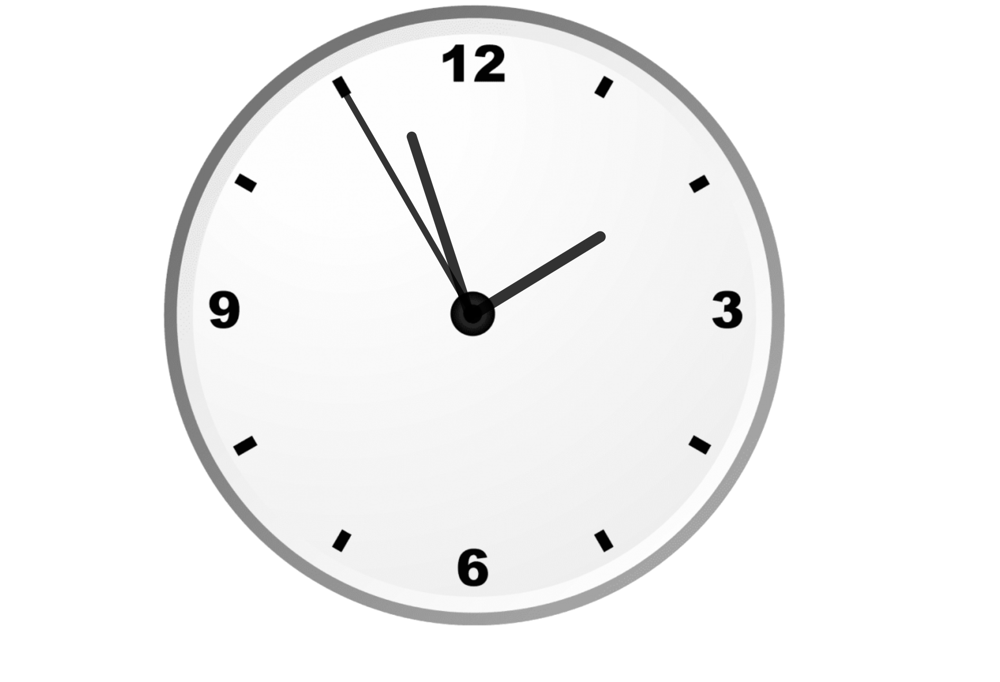

# 🕒 Analog Clock – HTML, CSS & JavaScript

This is a simple analog clock built using **HTML**, **CSS**, and **JavaScript**. The design is clean, responsive, and functional, mimicking a traditional wall clock.

## 🔧 Features

- Real-time clock updates using JavaScript
- Smooth rotating hour, minute, and second hands
- Clean and minimal design
- Responsive layout (works on desktop and mobile)

## 🛠️ Tech Stack

- **HTML** – Clock structure and labels
- **CSS** – Styling, positioning, and circular layout
- **JavaScript** – Time logic and hand rotation

## 📸 Screenshot

 

## 📂 How to Run Locally

1. Clone the repository:

   ```bash
   git clone https://github.com/rajatDevX/project3#
